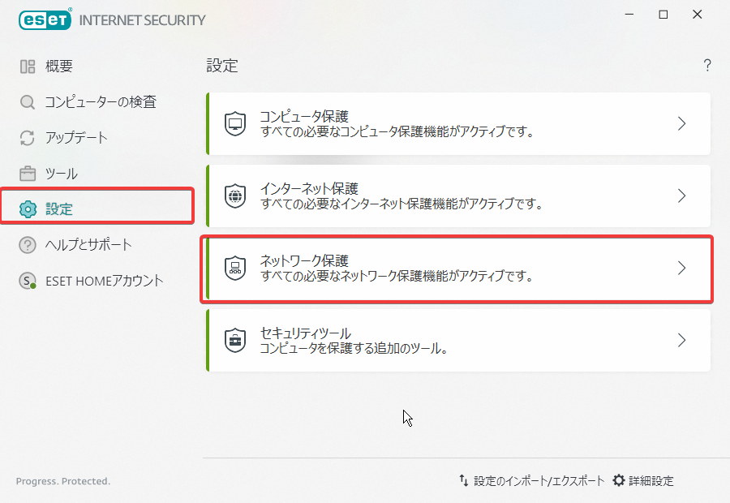
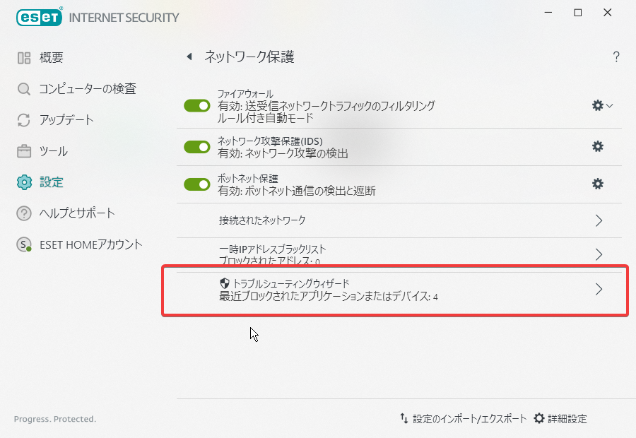
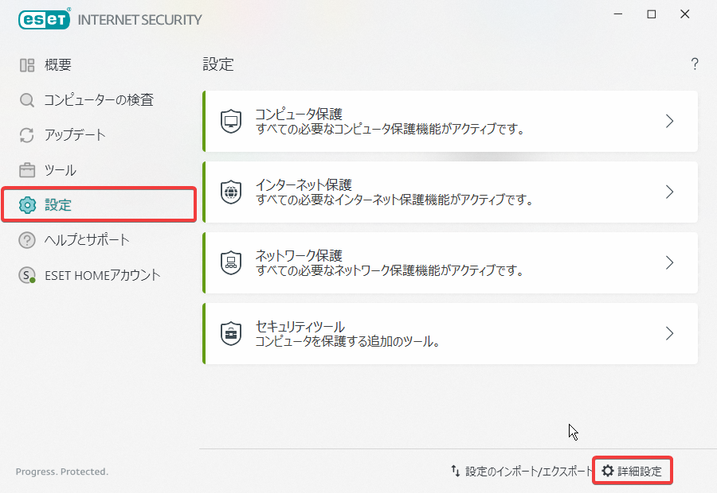
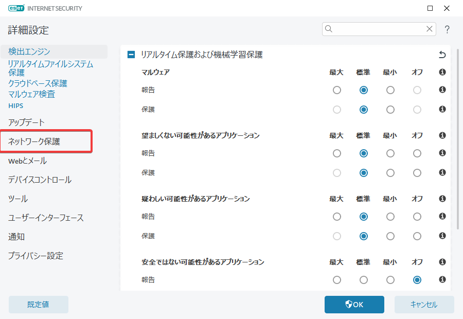
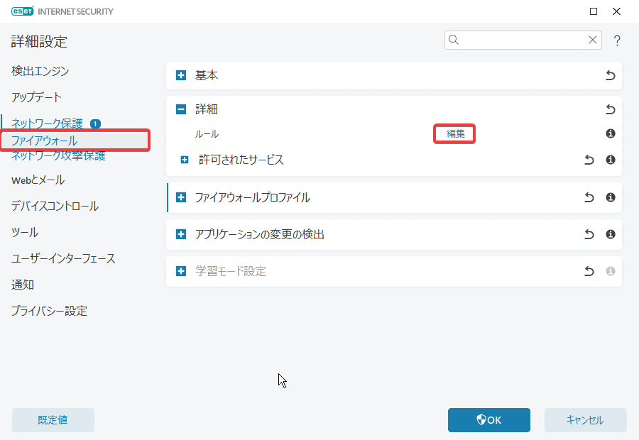
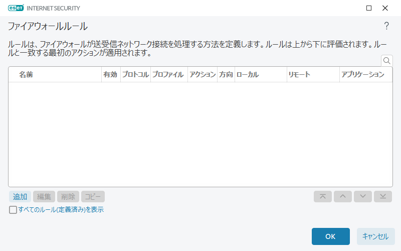
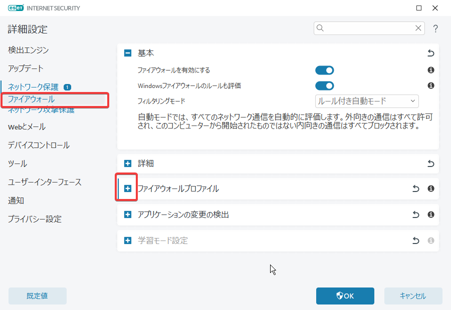
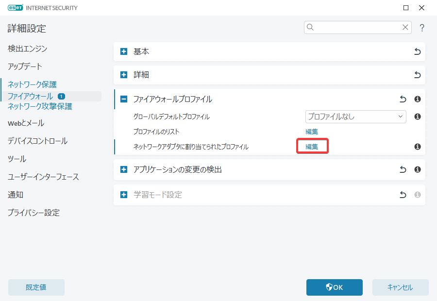

= ESETでFirewall設定

== Firewallで何が弾かれているかの確認

1. ESETの画面から[設定] -> [ネットワーク保護]

+

2. ネットワーク保護の画面で[最近ブロックさたアプリケーションまたはデバイス]

+

== Firewallルールの追加

1. [設定] -> [詳細設定]
+

2. 詳細設定の[ネットワーク保護]
+

3. [ファイアウォール] -> [編集]
+

4. ファイアウォールルールの[追加]
+

== Firewallルールの追加(インターフェース別に設定)

ざっと以下の手順になる。

1. インターフェースに適用するプロファイル作成
2. プロファイルにルールを追加
3. インターフェースにプロファイル適用

=== 1. インターフェースに適用するプロファイル作成

1. [設定] -> [詳細設定]
+

2. 詳細設定の[ネットワーク保護]
+

3. ネットワーク保護の[ファイアウォール] -> ファイアウォールプロファイル[+]を開く
+

4. プロファイルのリストの[編集]でファイアウォールプロファイルを開き追加
+

=== 2. プロファイルにルールを追加 

**Firewallルールの追加** の手順と同じ。ルール追加時に対象のプロファイルを選択する。

=== 3. インターフェースにプロファイル適用

1. ネットワークアダプタに割り当てられたプロファイルの[編集]でインターフェースにプロファイルを設定
+
