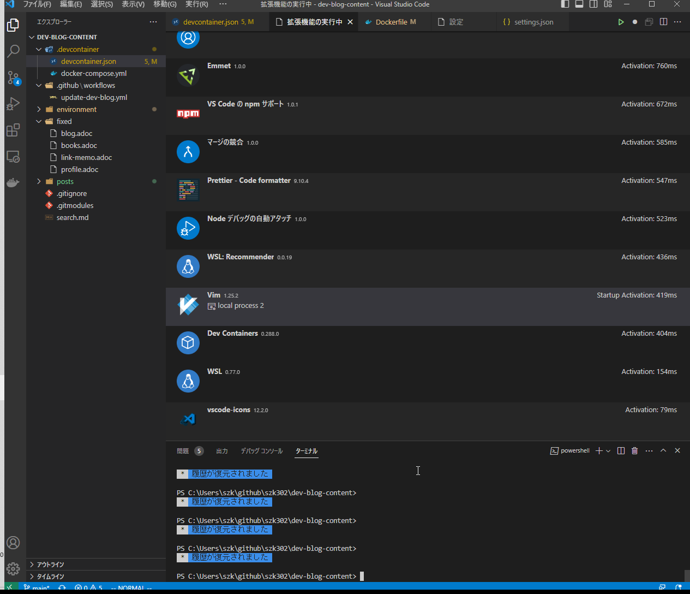

= VSCodeのVimプラグインで入力が遅い

VSCodeのVimプラグインでキー押下時に異様に遅くワンテンポ遅れて入力されるので対応

拡張ホストプロセスは共通プロセスで動いており他の拡張の影響を受けているらしい。 + 
vim拡張だけ専用の拡張ホストプロセスで動かすよう設定する。

== 対応

*settings.json* に以下の設定を追加

[source,json]
----
"extensions.experimental.affinity": {
	"vscodevim.vim": 1,
},
----

== 確認

`F1 > Developer: Show Running Extensions` で Vimの部分に *local process 2* と表示されていることを確認

== 参考

* https://github.com/microsoft/vscode/issues/137314[[blocking issue\] Extension Host Process exited with code: null, signal: SIGSEGV - VSCode reloads frequently. #137314]
* https://github.com/microsoft/vscode/issues/65876#issuecomment-1078827200[Overriding the default 'type' command and then calling the default 'type' command results in significantly slower execution time #65876]