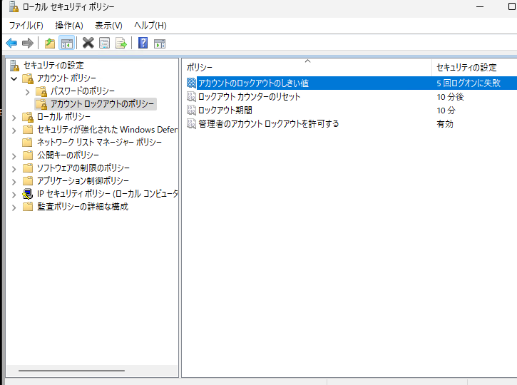
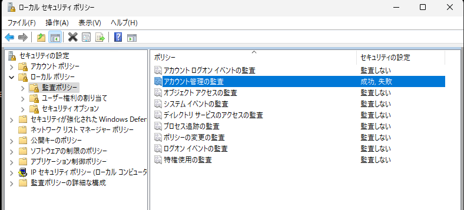
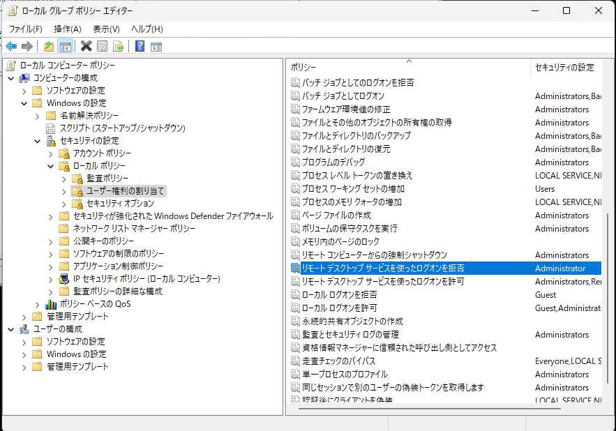

= リモートデスクトップで接続試行回数制限を設定する

RDP接続でつなげるPCを配置することにした。 +
家のネットワークはVLAN入れないまま、IOT機器つなげているので、最低限の接続制限と監視設定を行うことにした。

== 方法

アカウント ロックアウトのポリシーを設定し、連続してログイン失敗した場合は一定時間ロックされるよう設定する。
また、Administratorユーザはリモート接続できないよう設定

== 手順

=== アカウントロックアウトポリシーの設定

1. ローカルセキュリティポリシーでロックアウトのしきい値設定
** セキュリティの設定 -> アカウントロックアウトのポリシー -> アカウントのロックアウトのしきい値
+

2. ロックアウト時の監査ログの設定
** セキュリティの設定 -> ローカルポリシー -> 監査ポリシー -> アカウント管理の監査
+

=== Administratorユーザのリモートログイン拒否

1. ローカルグループポリシーでAdministratorユーザのリモートログイン拒否設定
** ローカルコンピュータポリシー -> コンピュータの構成 -> Windowsの設定 -> セキュリティ設定 -> ローカルポリシー -> ユーザー権利の割り当て
+

NOTE:: ロックアウトのイベントIDは4740

== TODO

* 接続で失敗が発生した場合はLineかメールに通知できるようにしたい。

== 参考

* https://learn.microsoft.com/ja-jp/windows/security/threat-protection/auditing/event-4740[4740(S): ユーザー アカウントがロックアウトされました。]